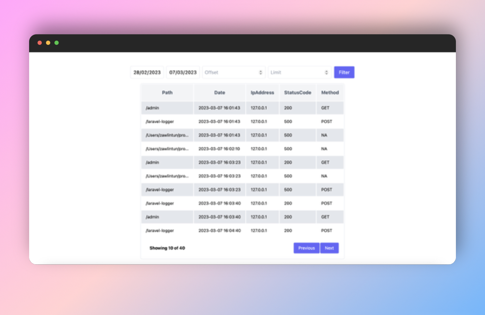

# Laravel Logger

> ### This package is still in development.



## Table Of Contents

- [Introduction](#introduction)
- [Features](#features)
- [Installation](#installation)
- [How To Use](#how-to-use)
- [License](#license)
- [Contributing](#contributing)
- [Support](#support)

## Introduction

## Features

- Less configuration 📄📄
- Easy to use &nbsp;🟢
- Easy to customize your needs &nbsp; 🕹
- Support log type as `model` or `file` type.
- Built in UI for viewing logs in your application.&nbsp;📌
- Beautiful RESPONSIVE UI with TailwindCss and vanilla Javascript &nbsp;💖
- If you don't want to use built-in view, you can integrate logs viewer with your defer framework 🔗

## Installation

```
composer require zawlintun/laravel-logger
```

### Publish config file

```
php artisan vendor:publish --tag=laravel-logger-config
```

### Publish migration ( Optional )

If you set the log type to `model`, you need to publish the migration file.

```
php artisan vendor:publish --tag=laravel-logger-migrations
```

### Publish public assets and views ( Optional )

> If you don't want to use built-in log viewer, you don't need to do the following. You may
> customize [here](#customizing-log-viewer).

In order to use built-in log viewer, you need to publish public assets and blade view file.

```
php artisan vendor:publish --tag=laravel-logger-assets && php artisan vendor:publish --tag=laravel-logger-views
```

## How To Use

**Middleware for logging responses of all web endpoints will be handled by the package automatically.**

You may also use the `laravel-logger-log-response` middleware in where you want.
For example,

```php
Route::middleware('laravel-logger-log-response')->get('/',function(){
   // ....
})
```

## Viewing Logs

If you have published public assets and views, you can view the logs table by visiting `/laravel-logger`.

### Logging Additional Meta Data

Register your custom log meta data closure inside `App\Providers\AppServiceProvider`.

```php
// App\Providers\AppServiceProvider.php
use Zawlintun\LaravelLogger\Services\Logger;

public function boot(){
   // .... 
   Logger::registerMetaData('test', function (Request $request, Response $response, \Throwable $throwable) {
            return now()->format('Y-m-d H:i:s');
   });
}
```

## Customizing Log Viewer

### Customizing CSS styles

### Integrating Log Viewer into your app

You can load the log table inside your app.

- Install package dependency.

```bash
npm install ./vendor/zawlintun/laravel-logger/resources/js
```

- Build the table inside your element

```js
import LaravelLogger from 'laravel-logger'

const logger = new LaravelLogger;

logger.build(document.querySelector('.your-element'))
```

- Setup css
  You can either load the css from the package or you can include the package file inside your `tailwind.config.js`
  file.

```js
// load the package css file inside resources/js/app.js
import '../../vendor/zawlintun/laravel-logger/public/style.css'

// OR add the package file inside your tailwind.config.js file
module.exports = {
    // content: [ .... , './vendor/zawlintun/laravel-logger/resources/js/*.ts'], 
}
```

## License

## Contributing

## Support
